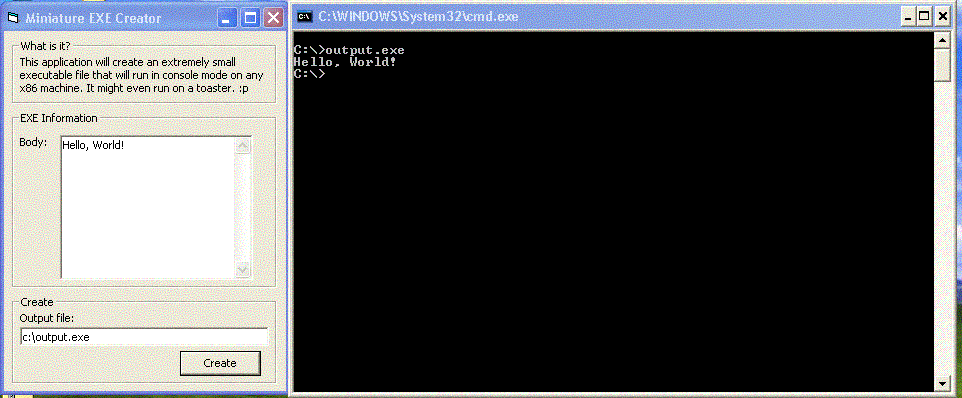



## Make a mini EXE\!

### Description

Check out this code. It will create a standalone EXE that will run on any x86 machine, OS independent. Also, extremely small file. An exe with "Hello, World!" is only 23 BYTES! It is truely amazing!
 
### More Info
 

             |
---                |---
**Submitted On**   |2002-02-08 01:55:04
**By**             |[Armen Shimoon](https://github.com/Planet-Source-Code/PSCIndex/blob/master/ByAuthor/armen-shimoon.md)
**Level**          |Beginner
**User Rating**    |3.3 (26 globes from 8 users)
**Compatibility**  |VB 6\.0
**Category**       |[Files/ File Controls/ Input/ Output](https://github.com/Planet-Source-Code/PSCIndex/blob/master/ByCategory/files-file-controls-input-output__1-3.md)
**World**          |[Visual Basic](https://github.com/Planet-Source-Code/PSCIndex/blob/master/ByWorld/visual-basic.md)
**Archive File**   |[Make\_a\_min53886282002\.zip](https://github.com/Planet-Source-Code/armen-shimoon-make-a-mini-exe__1-31605/archive/master.zip)

